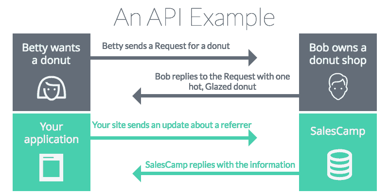

<div align="center" id="top"> 
  

  &#xa0;

  <!-- <a href="https://api.netlify.app">Demo</a> -->
</div>

<h1 align="center">Api</h1>

<p align="center">
  

  

  

  

  <!--  -->

  <!--  -->

  <!--  -->
</p>

<!-- Status -->

<!-- <h4 align="center"> 
	🚧  Api 🚀 Under construction...  🚧
</h4> 

<hr> -->

<p align="center">
  <a href="#dart-about">About</a> &#xa0; | &#xa0; 
  <a href="#why">Why do I want to use an API?</a> &#xa0; | &#xa0;
  <a href="#why">How does an API work?</a> &#xa0; | &#xa0; 
  <a href="#sparkles-features">Features</a> &#xa0; | &#xa0;
  <a href="#rocket-technologies">Technologies</a> &#xa0; | &#xa0;
  <a href="#white_check_mark-requirements">Requirements</a> &#xa0; | &#xa0;
  <a href="#checkered_flag-starting">Starting</a> &#xa0; | &#xa0;
  <a href="#memo-license">License</a> &#xa0; | &#xa0;
  <a href="https://github.com/eduardm1" target="_blank">Author</a>
</p>

<br>

## :dart: About ##

This project is intended to serve as a start for a REST API for the 3rd module, Business Intelligence and IT, within the University of Twente. 

Even though the API routes that are created within this project are probably not fit for your case, this README should be enough to help you design it for your own case.


## :question: Why an API? ##

APIs help software developers to streamline and shorten the application building process by eliminating frequently repeated program development processes. In short, they help you not to keep reinventing the wheel every time you are using the same procedure to build applications. 

The purpose of this API is to sit between your application (e.g. your Mendix application) and your database (e.g. the PostgreSQL hosted on Azure).

By doing so, we can easily retrieve the data from the database and manipulate it as we like. If not this API, we would have to manually import the CSVs in the modeler and we don't want that, right?



## :question: How does an API work? ##

An API request occurs when a developer adds an endpoint to a URL and makes a call to the server.

An API endpoint refers to the touchpoints of interaction between an API and another system.  An endpoint provides the location where an API accesses the resources they need. An API works by requesting information from a server and then receiving a response after that. 

For more information about REST operations, please check: https://learning.postman.com/docs/getting-started/sending-the-first-request/.

## :sparkles: Features ##

:heavy_check_mark: Feature 1;\
:heavy_check_mark: Feature 2;\
:heavy_check_mark: Feature 3;

## :rocket: Technologies ##

The following tools were used in this project:

- [Expo](https://expo.io/)
- [Node.js](https://nodejs.org/en/)
- [React](https://pt-br.reactjs.org/)
- [React Native](https://reactnative.dev/)
- [TypeScript](https://www.typescriptlang.org/)

## :white_check_mark: Requirements ##

Before starting :checkered_flag:, you need to have [Git](https://git-scm.com) and [Node](https://nodejs.org/en/) installed.

## :checkered_flag: Starting ##

```bash
# Clone this project
$ git clone https://github.com/{{YOUR_GITHUB_USERNAME}}/api

# Access
$ cd api

# Install dependencies
$ yarn

# Run the project
$ yarn start

# The server will initialize in the <http://localhost:3000>
```

## :memo: License ##

This project is under license from MIT. For more details, see the [LICENSE](LICENSE.md) file.


Made with :heart: by <a href="https://github.com/{{YOUR_GITHUB_USERNAME}}" target="_blank">{{YOUR_NAME}}</a>

&#xa0;

<a href="#top">Back to top</a>
